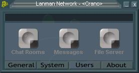



## Lanman Network

### Description

Client/Server network/internet application. Full skinning support. Has Private/Public chat-rooms (Optional password), Messageboard (Private/Public), Peer2Peer file-search/transfer. Also has multi-user login to the server application.
 
### More Info
 

             |
---                |---
**Submitted On**   |2002-07-20 17:09:52
**By**             |[Andrew C](https://github.com/Planet-Source-Code/PSCIndex/blob/master/ByAuthor/andrew-c.md)
**Level**          |Advanced
**User Rating**    |3.7 (11 globes from 3 users)
**Compatibility**  |VB 5\.0, VB 6\.0
**Category**       |[Complete Applications](https://github.com/Planet-Source-Code/PSCIndex/blob/master/ByCategory/complete-applications__1-27.md)
**World**          |[Visual Basic](https://github.com/Planet-Source-Code/PSCIndex/blob/master/ByWorld/visual-basic.md)
**Archive File**   |[Lanman\_Net113455822002\.zip](https://github.com/Planet-Source-Code/andrew-c-lanman-network__1-37530/archive/master.zip)

